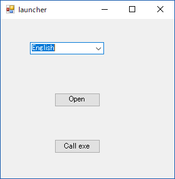

# WinMultiLanguageTest
多言語対応のテスト  
dummy_id.xlsxから動的にリソースファイルを生成する  

# 開発環境
VisualStudio 2015  
ClosedXML

# サンプルプログラムの使い方

  
- Japanese・Englishを切り替えるとボタンやメッセージの表示が切り替わります。
- メインフォームをクリックすると選択された言語でフォームが開きます。
- exe実行をクリックすると別の実行ファイル(ExeProjectプロジェクトで作成された実行ファイル)を選択された言語で開きます。  

# 実装のポイント
多言語対応をする上でポイントとなるクラスは下記の二つです。

### LanguageResourceUtilityクラス
シングルトンクラス。  
ExcelToResourceクラスで作成したリソースファイル(Resouce.resx)を読み込む。   
IDに紐づいた文字列(日本語・英語)を返す。

### ExcelToResourceクラス
Excelファイル(.xls)からリソースファイル(Resouce.resx)を動的に生成するクラス。  
LanguageResourceUtilityクラス内で使用する。
